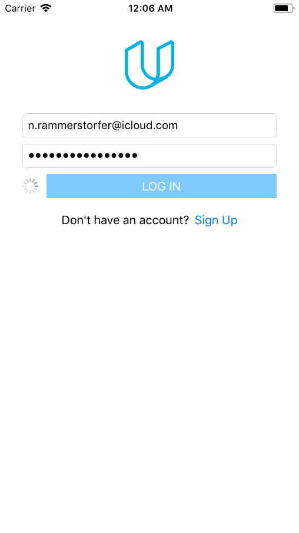
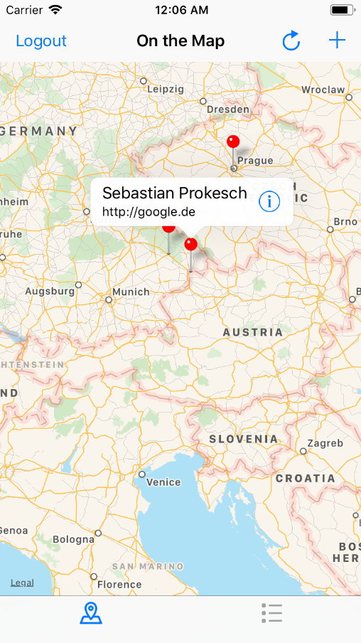
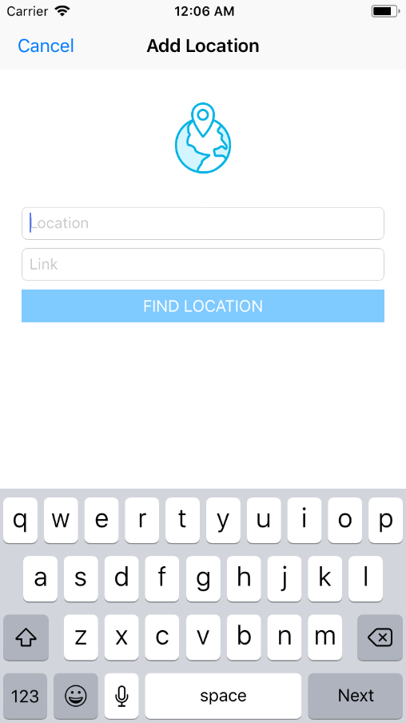

# On the Map (3/5)

This is the third part of a five part series of sample apps created for [Udacity's Nanodegree "Become an iOS Developer"](https://udacity.com/course/ios-developer-nanodegree--nd003).

With On the Map you can pin a link on a _MapView_ at a location. All other Udacity students implement their own version 
of the app and can view the links of other students. To be able to access the app's functions you first have to 
log in using an Udacity account.

Learning goal of this app was to learn how to handle __(REST-)APIs__. This includes:

* Authentication (and authorisation) at APIs via SessionIDs and processes similar to OAuth.
* Interacting with an API via HTTP-Methods (GET, PUT, POST, DELETE)

## Screenshots
  

## Getting Started

These instructions will get you a copy of the project up and running on your local machine for development and testing purposes.

### Prerequisites

* XCode version that is capable of supporting Swift 4.0
* An Udacity account. [You can create one here](https://auth.udacity.com/sign-up?next=https%3A%2F%2Fclassroom.udacity.com%2Fauthenticated)

## Built With

_There were no external libraries used for this project._

## Authors

* **Niklas Rammerstorfer** - *Initial work* - [Shanakor](https://github.com/Shanakor)
